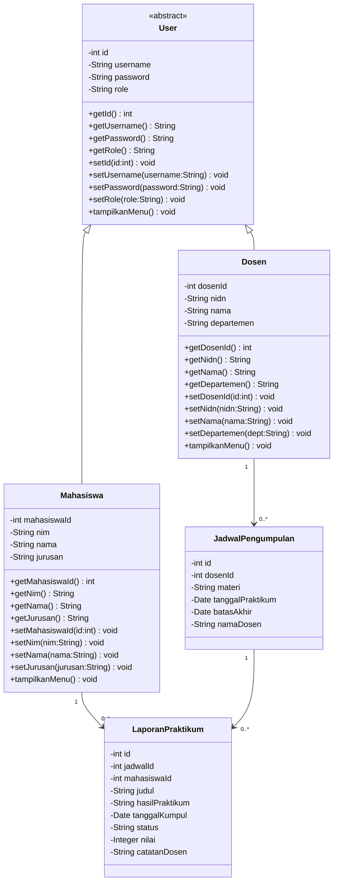
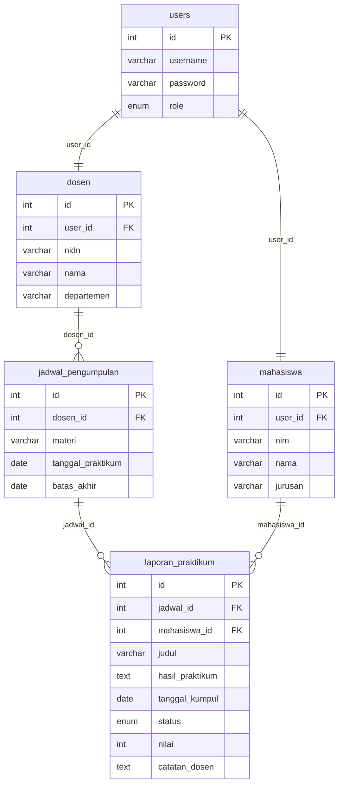
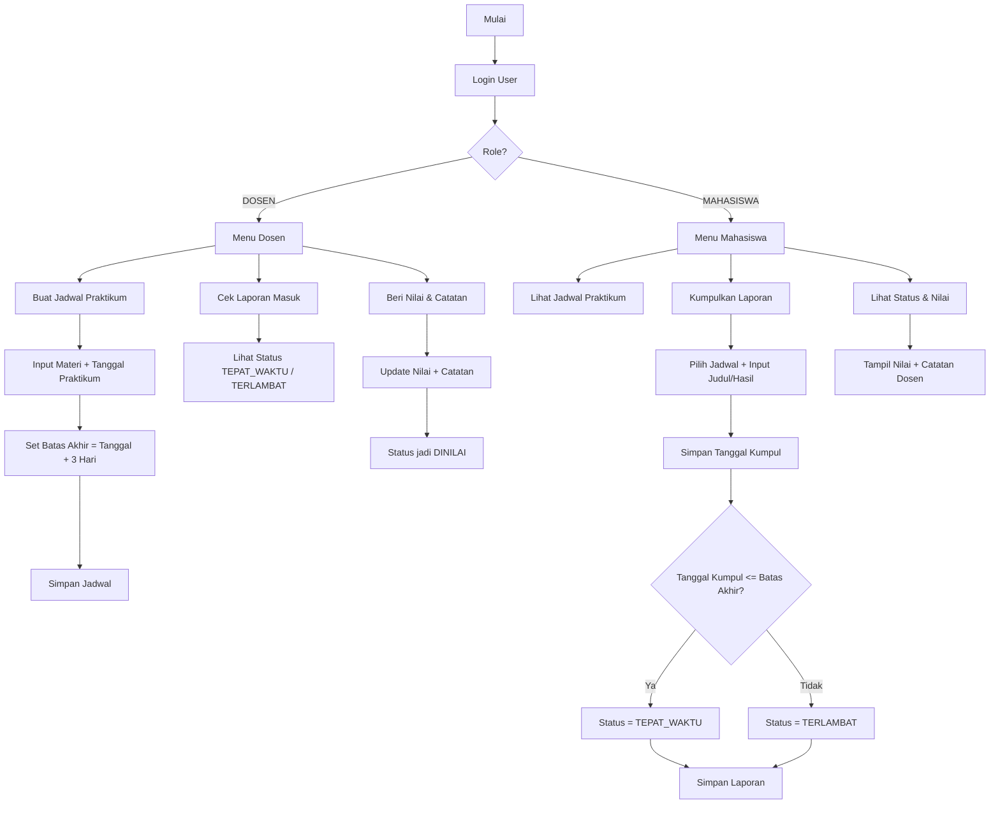

# Tugas-1-PBO-DapotMatthewTampubolon

Dokumentasi ini mengikuti format lengkap seperti referensi, namun isi disesuaikan dengan implementasi program Dapot (alur **jadwal pengumpulan laporan praktikum**).

# BAGIAN 1 — ANALISIS SISTEM

## 1. Identifikasi Class Utama

| Class                                   | Atribut                                                                                                       | Method                                                                                                                                                                                                                                                                                                  |
| :-------------------------------------- | :------------------------------------------------------------------------------------------------------------ | :------------------------------------------------------------------------------------------------------------------------------------------------------------------------------------------------------------------------------------------------------------------------------------------------------ |
| **User** _(Abstract Class)_             | `id`, `username`, `password`, `role`                                                                          | `getId()`, `setId()`, `getUsername()`, `setUsername()`, `getPassword()`, `setPassword()`, `getRole()`, `setRole()`, `tampilkanMenu()`                                                                                                                                                              |
| **Mahasiswa** _(Extends User)_          | `mahasiswaId`, `nim`, `nama`, `jurusan`                                                                       | `getMahasiswaId()`, `setMahasiswaId()`, `getNim()`, `setNim()`, `getNama()`, `setNama()`, `getJurusan()`, `setJurusan()`, `tampilkanMenu()`                                                                                                                                                        |
| **Dosen** _(Extends User)_              | `dosenId`, `nidn`, `nama`, `departemen`                                                                       | `getDosenId()`, `setDosenId()`, `getNidn()`, `setNidn()`, `getNama()`, `setNama()`, `getDepartemen()`, `setDepartemen()`, `tampilkanMenu()`                                                                                                                                                        |
| **JadwalPengumpulan**                   | `id`, `dosenId`, `materi`, `tanggalPraktikum`, `batasAkhir`, `namaDosen`                                     | `getId()`, `setId()`, `getDosenId()`, `setDosenId()`, `getMateri()`, `setMateri()`, `getTanggalPraktikum()`, `setTanggalPraktikum()`, `getBatasAkhir()`, `setBatasAkhir()`, `getNamaDosen()`, `setNamaDosen()`                                                                                    |
| **LaporanPraktikum**                    | `id`, `jadwalId`, `mahasiswaId`, `judul`, `hasilPraktikum`, `tanggalKumpul`, `status`, `nilai`, `catatanDosen` | `getId()`, `setId()`, `getJadwalId()`, `setJadwalId()`, `getMahasiswaId()`, `setMahasiswaId()`, `getJudul()`, `setJudul()`, `getHasilPraktikum()`, `setHasilPraktikum()`, `getTanggalKumpul()`, `setTanggalKumpul()`, `getStatus()`, `setStatus()`, `getNilai()`, `setNilai()`, `getCatatanDosen()`, `setCatatanDosen()` |
| **DatabaseConfig**                      | `URL`, `USER`, `PASSWORD`, `connection`                                                                       | `getConnection()`                                                                                                                                                                                                                                                                                       |
| **BaseDAO** _(interface)_               | _-_                                                                                                           | `insert()`, `findById()`, `findAll()`, `update()`, `delete()`                                                                                                                                                                                                                                          |
| **UserDAO** _(interface)_               | _-_                                                                                                           | _(Mewarisi method BaseDAO)_ + `authenticate()`, `isUsernameExist()`                                                                                                                                                                                                                                    |
| **MahasiswaDAO** _(interface)_          | _-_                                                                                                           | _(Mewarisi method BaseDAO)_ + `findByNim()`, `isNimExist()`                                                                                                                                                                                                                                            |
| **DosenDAO** _(interface)_              | _-_                                                                                                           | _(Mewarisi method BaseDAO)_ + `findByNidn()`, `isNidnExist()`                                                                                                                                                                                                                                          |
| **JadwalPengumpulanDAO** _(interface)_  | _-_                                                                                                           | _(Mewarisi method BaseDAO)_ + `findByDosenId()`                                                                                                                                                                                                                                                         |
| **LaporanPraktikumDAO** _(interface)_   | _-_                                                                                                           | _(Mewarisi method BaseDAO)_ + `findByMahasiswaId()`, `findByDosenId()`, `updateNilaiDanCatatan()`                                                                                                                                                                                                    |

### Sistem ini menerapkan dua konsep utama:

1. **Data Access Object (DAO) Pattern**: Memisahkan logika akses data dari antarmuka/menu.
2. **Pemrograman Berorientasi Objek (OOP)**: Struktur program berpusat pada class, object, pewarisan, dan enkapsulasi.

## 2. Hubungan Antar Class

Semua atribut dalam class dideklarasikan `private` sebagai bentuk enkapsulasi.

**a) INHERITANCE (Pewarisan)**

- `Mahasiswa` extends `User`.
- `Dosen` extends `User`.
- Seluruh DAO interface (`UserDAO`, `MahasiswaDAO`, `DosenDAO`, `JadwalPengumpulanDAO`, `LaporanPraktikumDAO`) extends `BaseDAO<T>`.

**b) ABSTRACTION (Abstraksi)**

- `User` adalah abstract class dengan abstract method `tampilkanMenu()`.
- `BaseDAO<T>` adalah interface generic untuk kontrak CRUD.

**c) IMPLEMENTS (Implementasi Interface)**

- `UserDAOImpl` implements `UserDAO`
- `MahasiswaDAOImpl` implements `MahasiswaDAO`
- `DosenDAOImpl` implements `DosenDAO`
- `JadwalPengumpulanDAOImpl` implements `JadwalPengumpulanDAO`
- `LaporanPraktikumDAOImpl` implements `LaporanPraktikumDAO`

**d) DEPENDENCY (Ketergantungan/Asosiasi)**

- `JadwalPengumpulan` bergantung pada `Dosen` melalui `dosenId`.
- `LaporanPraktikum` bergantung pada `Mahasiswa` dan `JadwalPengumpulan` melalui `mahasiswaId` dan `jadwalId`.
- Semua class DAO implementation bergantung pada `DatabaseConfig.getConnection()`.
- `Main` bergantung pada seluruh DAO dan model class sebagai pusat alur.

## 3. Alasan Pemilihan Atribut dan Method

**a) Class User (Abstract)**

- Atribut `id`, `username`, `password`, `role` wajib untuk identitas dan autentikasi.
- `tampilkanMenu()` dibuat abstract karena menu tiap role berbeda.

**b) Class Mahasiswa**

- `nim`, `nama`, `jurusan` dibutuhkan sebagai identitas akademik mahasiswa.
- Menu mahasiswa fokus pada lihat jadwal, kumpul laporan, dan lihat nilai.

**c) Class Dosen**

- `nidn`, `nama`, `departemen` dibutuhkan untuk identitas pengampu praktikum.
- Menu dosen fokus pada membuat jadwal, mengecek laporan, dan memberi nilai.

**d) Class JadwalPengumpulan**

- `materi`, `tanggalPraktikum`, `batasAkhir` dipakai untuk mendefinisikan tugas dan tenggat.
- Tenggat ditetapkan otomatis `+3 hari` dari tanggal praktikum.

**e) Class LaporanPraktikum**

- `judul`, `hasilPraktikum`, `tanggalKumpul` untuk isi laporan mahasiswa.
- `status` (`TEPAT_WAKTU`, `TERLAMBAT`, `DINILAI`), `nilai`, dan `catatanDosen` untuk evaluasi.

**f) Class DatabaseConfig**

- Menggunakan Singleton agar koneksi database terpusat dan efisien.

**g) Interface BaseDAO<T>**

- Generic DAO dipakai agar operasi CRUD tidak ditulis ulang untuk setiap entitas.

# BAGIAN 2 — DESAIN DIAGRAM

## 1. Class Diagram



## 2. ERD



## 3. Workflow



# BAGIAN 3 — IMPLEMENTASI PROGRAM JAVA

Sistem Pengumpulan Tugas Laporan Praktikum adalah aplikasi berbasis **Command Line Interface (CLI)** menggunakan Java dan MySQL.

Sistem memiliki dua role utama:

| Role          | Deskripsi                                                                                                    |
| ------------- | ------------------------------------------------------------------------------------------------------------- |
| **Mahasiswa** | Melihat jadwal praktikum, mengumpulkan laporan, dan melihat nilai/catatan dosen.                           |
| **Dosen**     | Membuat jadwal praktikum, mengecek laporan masuk, dan memberi nilai/catatan laporan mahasiswa.             |

## Fitur-Fitur Utama Sistem

### 1. Menambahkan Data

- **Buat Jadwal Praktikum** — Dosen mengisi materi dan tanggal praktikum, lalu sistem menyimpan jadwal dengan batas akhir otomatis (`+3 hari`) melalui `JadwalPengumpulanDAO.insert()`.
- **Kumpulkan Laporan Praktikum** — Mahasiswa memilih jadwal, mengisi judul dan hasil praktikum, lalu sistem menyimpan melalui `LaporanPraktikumDAO.insert()`.

### 2. Menampilkan Data

- **Daftar Jadwal Praktikum** — Mahasiswa melihat semua jadwal dari dosen menggunakan `JadwalPengumpulanDAO.findAll()`.
- **Daftar Laporan Masuk** — Dosen melihat laporan mahasiswa menggunakan `LaporanPraktikumDAO.findByDosenId()`.
- **Status dan Nilai Laporan** — Mahasiswa melihat status keterlambatan, nilai, dan catatan menggunakan `LaporanPraktikumDAO.findByMahasiswaId()`.

### 3. Mengubah Status Data

- **Status Ketepatan Waktu Otomatis** — Saat insert laporan, sistem otomatis menentukan status `TEPAT_WAKTU` atau `TERLAMBAT` berdasarkan `tanggal_kumpul` dan `batas_akhir`.
- **Proses Penilaian** — Dosen mengisi nilai dan catatan melalui `LaporanPraktikumDAO.updateNilaiDanCatatan()`, lalu status menjadi `DINILAI`.

## Alur Kerja Sistem (Workflow) — Detail

1. Pengguna login melalui `UserDAO.authenticate()`.
2. Jika role **Dosen**, pengguna dapat membuat jadwal dan menilai laporan.
3. Jika role **Mahasiswa**, pengguna dapat melihat jadwal dan mengumpulkan laporan.
4. Sistem mengecek ketepatan waktu pengumpulan secara otomatis.
5. Dosen memberikan nilai dan catatan, mahasiswa melihat hasil penilaian.

## Teknologi dan Tools yang Digunakan

| Komponen           | Teknologi                        |
| ------------------ | -------------------------------- |
| Bahasa Pemrograman | **Java** (JDK)                   |
| Database           | **MySQL**                        |
| Driver Koneksi     | **MySQL Connector/J** (JDBC)     |
| Antarmuka          | **Command Line Interface (CLI)** |
| IDE                | Visual Studio Code               |

## Cara Menjalankan Program

Panduan detail ada di `RUNNING.md`. Ringkasnya:

```bash
cd /home/potydev/tugas/Tugas-1-PBO-DapotMatthewTampubolon
mysql -u pbo_user -pPbo!Praktikum2026 db_laporan_praktikum < database.sql
javac -cp "lib/*" -d bin $(find src -name "*.java")
java -cp "bin:lib/*" Main
```

# BAGIAN 4 — ANALISIS KONSEP PBO

## 1. Penerapan Class dan Object

Class dipakai sebagai blueprint (`User`, `Mahasiswa`, `Dosen`, `JadwalPengumpulan`, `LaporanPraktikum`), sedangkan object dibuat saat program berjalan, misalnya object user setelah login dan object laporan saat submit.

## 2. Penerapan Enkapsulasi

Seluruh atribut model dideklarasikan `private` dan diakses melalui getter/setter sehingga data lebih aman dan terkontrol.

## 3. Mengapa PBO Lebih Baik dari Prosedural?

| Aspek            | PBO                                                                                             | Prosedural                                                       |
| ---------------- | ----------------------------------------------------------------------------------------------- | ---------------------------------------------------------------- |
| Organisasi       | Kode dipisah per class (`model`, `dao`, `impl`, `config`)                                     | Kode cenderung menumpuk dalam fungsi panjang                     |
| Reusability      | Pewarisan `Mahasiswa`/`Dosen` dari `User` mengurangi duplikasi                                | Banyak bagian harus ditulis ulang                                |
| Skalabilitas     | Menambah fitur/role baru lebih mudah karena struktur modular                                   | Perubahan kecil bisa berdampak ke banyak fungsi                  |
| Keamanan Data    | Enkapsulasi (`private` + getter/setter)                                                         | Data rentan diubah sembarang jika tidak dibatasi                 |
| Maintainability  | DAO memisahkan SQL dari logika menu                                                             | SQL dan logika bisnis sering bercampur                           |

# BAGIAN 5 — REFLEKSI

## 1. Bagian yang Paling Sulit

Bagian paling menantang adalah memastikan konsistensi alur **deadline otomatis, status otomatis, dan grading** agar sinkron antara menu CLI, model, DAO, dan database.

## 2. Hal Baru yang Dipelajari tentang Konsep PBO

- Penerapan abstract class sebagai kontrak menu per role.
- Polimorfisme saat objek `User` diarahkan ke perilaku `Mahasiswa` atau `Dosen`.
- Generic DAO untuk mengurangi duplikasi operasi CRUD.
- Separation of concerns antara model, DAO, config, dan main flow.

## 3. Fitur Pengembangan Lanjutan

1. Registrasi akun mandiri untuk mahasiswa dan dosen.
2. Upload file laporan (PDF/DOCX) selain input teks.
3. Notifikasi tenggat otomatis (H-1 deadline).
4. Dashboard statistik pengumpulan dan keterlambatan.
5. Migrasi antarmuka dari CLI ke GUI/Web.
